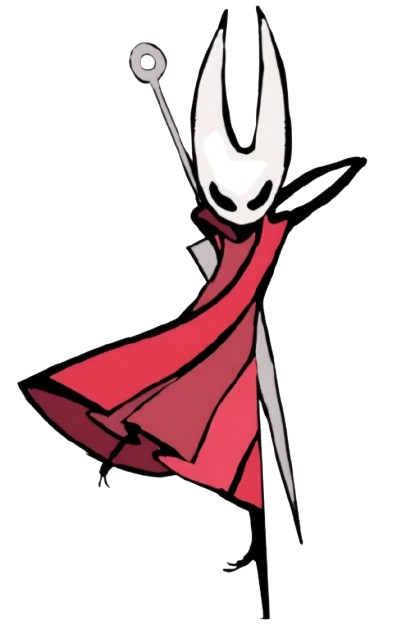

## Hi there, I'm Ivan Vitor 👋

🖥️ Computer Science undergraduate at the Federal University of Piauí (UFPI). 
 
🔭 Curious, generalist, passionate about competitive programming, and an advocate for democratizing knowledge.
 
🌱 Currently studying Artificial Intelligence, Large Language Models, and Software Development.

  <i>"True intelligence is revealed not in answers, but in questions."</i>

  

  <h2 align="center"> Tech Stack </h2>
  
  
  
  
  

  <table>
    <tr>
       
      
      
       
    </tr>
  </table>

  <table>
    <tr>
      <td>
        
      </td>
      <td>
        
      </td>
    </tr>
  </table>

  

  <h1>Connect with me</h1>
  
  
  

